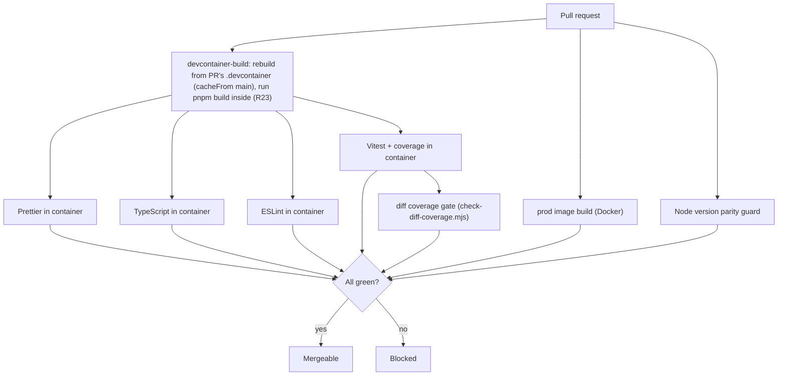
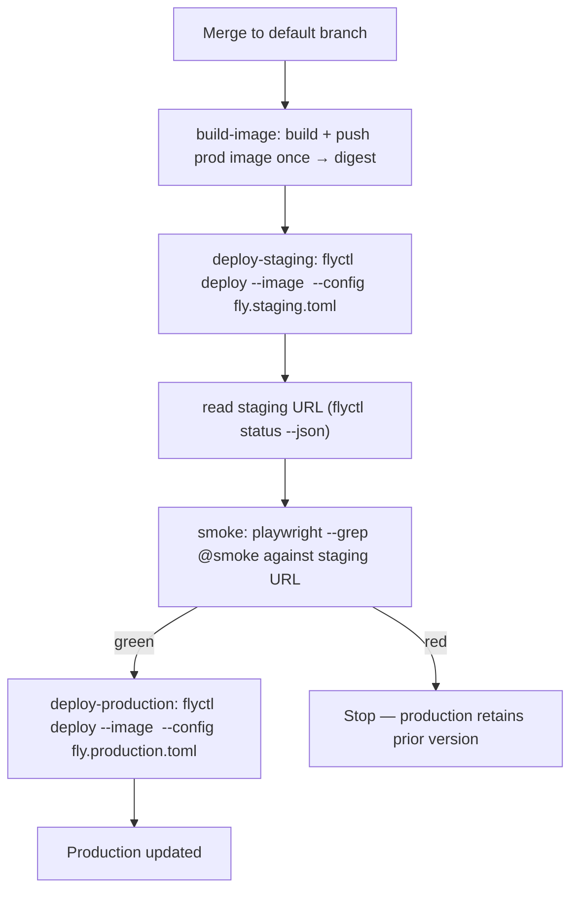
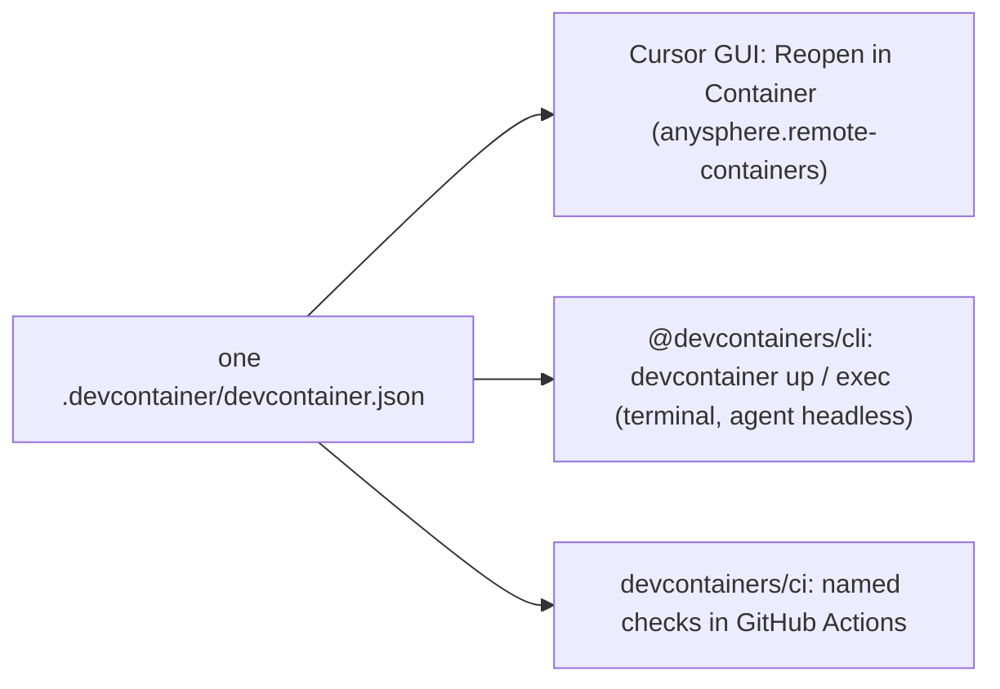

# feat: UAPKB scaffolding — AI-first reference repo

## Execution Progress

**Last updated:** 2026-06-16 (post-shipping session)

**Repository:** https://github.com/ademartini/uapkb — scaffold merged via [PR #1](https://github.com/ademartini/uapkb/pull/1) (`feat/uapkb-scaffolding` → `main`, 2026-06-16).

### Implementation status (U1–U19)

| Unit       | Status        | Notes                                                                                                                                                        |
| ---------- | ------------- | ------------------------------------------------------------------------------------------------------------------------------------------------------------ |
| **U1–U4**  | **Completed** | Next.js 16 scaffold, supply-chain hardening, lint/format ratchet, Vitest + placement.                                                                        |
| **U5**     | **Completed** | Coverage auto-ratchet + diff gate; both proven in PR CI.                                                                                                     |
| **U6–U18** | **Completed** | Devcontainer (image-only + compose Postgres for local), husky, Cursor config, `/healthz`, Dockerfile, Playwright smoke, fly.toml, CI/deploy workflows, docs. |
| **U19**    | **Completed** | `PRINCIPLES.md` audited.                                                                                                                                     |

**CI on PR #1:** all 10 checks green (devcontainer build, Prettier, TypeScript, ESLint, Vitest, coverage ratchet, coverage diff, audit, production image build, node parity).

**CI fixes landed in PR:** invalid Docker action SHAs; devcontainer switched from compose-embedded `dev` service to image-only (matches `xplor-test-app` pattern). Postgres remains `docker compose up -d db` for local dev.

### Post-merge gaps (resolved 2026-06-16)

| Item                        | Status       | Detail                                                                                                                                                                                                                                                                                                      |
| --------------------------- | ------------ | ----------------------------------------------------------------------------------------------------------------------------------------------------------------------------------------------------------------------------------------------------------------------------------------------------------- |
| **Deploy workflow**         | **Fixed**    | Invalid `setup-flyctl` SHA (`63de32d…` → `fc53c09e…` v1.5). Deploy now uses build-image **digest** (not full git SHA tag). `deploy-production` needs `[smoke, build-image]` so digest output is in scope. [Run 27650189224](https://github.com/ademartini/uapkb/actions/runs/27650189224) green end-to-end. |
| **GHCR devcontainer cache** | **Fixed**    | Repo workflow permissions set to read/write; `docker/login-action` added before `devcontainers/ci` push. Devcontainer prebuild push succeeds on `main`.                                                                                                                                                     |
| **fly.io apps**             | **Verified** | `uapkb-staging` and `uapkb-production` exist; staging and production deployed.                                                                                                                                                                                                                              |
| **GHCR app image public**   | **Verified** | `ghcr.io/ademartini/uapkb` package is **Public** (required for fly remote image pull).                                                                                                                                                                                                                      |
| **First deploy + smoke**    | **Proven**   | Staging → `@smoke` → production succeeded. Live: https://uapkb-staging.fly.dev , https://uapkb-production.fly.dev                                                                                                                                                                                           |
| **Neon / real DB**          | **Deferred** | `DATABASE_URL` placeholder only; `/healthz` reports `not_configured`.                                                                                                                                                                                                                                       |

### Remaining follow-ups (non-blocking)

| Item            | Status   | Detail                                                                                                     |
| --------------- | -------- | ---------------------------------------------------------------------------------------------------------- |
| **pnpm audit**  | **Open** | `main` quality-checks fails on transitive vite advisory (high); bump vite when `minimumReleaseAge` allows. |
| **APP_VERSION** | **Open** | fly secrets for build metadata still show `dev`/`unknown` in `/healthz`.                                   |

### Estimated fly.io cost

~**$3–4/month** (512 MB shared CPU; staging scale-to-zero, production `min_machines_running = 1`). See plan research notes / cost estimate session.

**Plan status:** `active` — scaffold shipped; first staging→smoke→production deploy proven on `main`.

---

## Summary

Stand up UAPKB as a greenfield Next.js (App Router) + TypeScript reference repo that wires AI-first engineering practices so they actually run. Start from the official `create-next-app` scaffold at latest versions, port and re-skin the proven quality core from the sibling `xplor-test-app` scaffold (Vitest, two-layer ESLint/Prettier, the lint-debt ratchet, husky gates, the devcontainer) from Claude Code to Cursor, and add the three things the prior scaffold never had: a Postgres dev database, a slim multi-stage production image, and smoke-gated continuous deployment to fly.io across staging and production. One devcontainer is used everywhere — local Cursor development, the terminal, and CI — so "works in CI" and "works on my machine" are the same claim. Coverage is gated two ways: a fixed minimum on changed lines, and a repo-wide floor that ratchets itself up (via Vitest's native `autoUpdate`, committed in each PR). No application domain logic, no ORM.

---

## Problem Frame

A reference repository teaches more by being run than by being read. The prior Next.js scaffold (`xplor-test-app`) established a strong quality core but stopped at dev-plus-CI: it has no database, no production image, and no deployment, and it is wired for Claude Code rather than Cursor. It also only _built_ its devcontainer in CI while running the actual checks on native Node — quietly contradicting the "same container locally and in CI" parity it preaches. The most instructive practices — reproducible environment parity across dev/CI/prod, smoke-gated promotion, agent-accessible deployment — are described in prose but never demonstrated in a repo someone can clone and watch work. UAPKB closes that gap: every practice it teaches is enforced somewhere in a lint rule, a hook, a CI check, or a deployment gate, and the parity claim is real because CI runs inside the same devcontainer.

A second motivation runs through the new constraints on this plan: the repo must model **secure** AI-first development without signing up for third-party SaaS. Packages are installed at latest applicable versions but vetted against supply-chain risk; GitHub Actions are SHA-pinned; the dependency install path blocks lifecycle scripts by default. The only hosted services in play are fly.io (deploy), Neon (future database), and GitHub/GitHub Actions/GHCR — no coverage SaaS, no external accounts beyond those.

---

## Output Structure

The scaffold produces roughly this layout. Per-unit `**Files:**` sections are authoritative; this tree is the scope-shape declaration.

```text
uapkb/
├── app/
│   ├── healthz/route.ts          # dependency-status health contract
│   ├── layout.tsx
│   ├── page.tsx                  # minimal landing page
│   └── globals.css               # Tailwind v4 CSS-first (@import "tailwindcss")
├── lib/                          # logger.ts (Pino) + health.ts; collocated unit tests live next to source here
├── tests/
│   ├── setup.ts                  # shared Vitest/RTL setup
│   └── *.test.tsx                # cross-cutting tests
├── e2e/
│   └── smoke.spec.ts             # @smoke-tagged Playwright suite
├── scripts/
│   ├── check.sh                  # full local gate (mirrors CI)
│   └── check-diff-coverage.mjs   # changed-line coverage gate (lcov ∩ git diff)
├── .devcontainer/
│   ├── devcontainer.json         # single pinned Node; Cursor CLI; composes with db
│   ├── devcontainer-lock.json    # SHA-pinned feature lock
│   └── README.md
├── .cursor/
│   ├── hooks.json                # afterFileEdit → format+lint; stop → end-of-turn gate
│   └── rules/                    # scoped *.mdc rules layered on AGENTS.md
├── .github/workflows/
│   ├── quality-checks.yml        # prebuild devcontainer → named checks inside it + coverage gates
│   ├── build-artifacts.yml       # prod-image build + Node-version parity guard
│   └── deploy.yml                # staging → smoke → production promotion
├── Dockerfile                    # multi-stage, standalone output
├── docker-compose.yml            # local Postgres
├── fly.staging.toml
├── fly.production.toml
├── playwright.config.ts
├── vitest.config.ts              # v8 coverage + repo-wide threshold floor
├── eslint.config.mjs
├── eslint-suppressions.json      # lint-debt baseline
├── pnpm-workspace.yaml           # supply-chain hardening settings
├── docs/
│   ├── coverage.md               # Vitest auto-ratchet + diff gate; why not bot-to-main
│   ├── devcontainer.md           # one container, three consumers (GUI / CLI / CI)
│   ├── testing.md / local-dev.md / deployment.md / runbook-rollback.md / logging.md
├── .nvmrc / .gitattributes / .git-blame-ignore-revs / .dockerignore
├── .cursorignore / .cursorindexingignore / .env.example
├── AGENTS.md  (+ CLAUDE.md symlink)
└── PRINCIPLES.md                 # already exists — audited/finalized, not authored
```

---

## Requirements

Requirements are carried from the origin brainstorm (`docs/brainstorms/2026-06-13-uapkb-scaffolding-requirements.md`), keeping their origin R-IDs. R37–R39 are this plan's added supply-chain emphasis.

### Project foundation and stack

- R1. Next.js App Router app in TypeScript with `strict: true`, pnpm pinned via `packageManager`, Tailwind v4 (CSS-first, no `tailwind.config.js`).
- R2. `next.config.ts` sets `output: 'standalone'`.
- R3. A single Node version is pinned and used identically by the devcontainer, CI, and the production Dockerfile, recorded where CI and local tooling both read it.
- R4. Quality-stack dev dependencies are exact-pinned (no `^`); bumping is deliberate.
- R5. No application domain logic, no ORM, no UAP feature beyond a health endpoint and minimal landing page.

### Code quality and ratcheting

- R6. Two-layer model: Prettier owns formatting, ESLint owns code quality, `eslint-config-prettier` applied last; EditorConfig provides the whitespace/EOL floor.
- R7. Lint debt ratcheted via ESLint native bulk suppressions: a committed baseline grandfathers existing violations, new violations fail, `suppress`/`prune` scripts widen or narrow the floor deliberately.
- R8. Lint runs with `--max-warnings 0`.
- R9. Supply-chain hygiene files present: `.gitattributes` (LF normalization), a `.git-blame-ignore-revs` template, `pnpm-workspace.yaml` configured to block unwanted postinstall scripts.

### Testing and coverage

- R10. Vitest configured with React Testing Library and jsdom, a shared setup file, the `@/` alias mirrored from `tsconfig.json`, and v8 coverage with sensible excludes.
- R11. Coverage enforced as a gate two ways: changed lines held to a fixed minimum percentage (the diff gate), and a repo-wide floor that can only rise (raised deliberately, never auto-lowered). Starting numbers set from a real baseline.
- R12. Test-placement conventions documented and followed: collocated unit tests next to source, cross-cutting tests in `tests/`, no `*.test.tsx` under `app/`.
- R13. Playwright configured for e2e smoke, with a `@smoke` tag on the minimal post-deploy subset, a configurable base URL, completing within the 5–15 minute budget.

### Local development environment

- R14. `.devcontainer` defines the local and CI environment: floating base image, SHA-pinned features with a committed lock file, installs via `updateContentCommand` with `--frozen-lockfile`, dev port forwarded.
- R15. A Docker Compose stack runs Postgres for local development, started by a documented single command.
- R16. The devcontainer composes with the Postgres service; credentials/state persist across rebuilds.
- R17. A single documented command performs clone-to-running: install, start services, run tests.

### Cursor and AI-first configuration

- R18. A root `AGENTS.md` is the canonical agent entry-point (commands, directory map, conventions, safety boundaries), concise and pointer-based, with `.cursor/rules/*.mdc` for scoped Cursor-specific rules. A `CLAUDE.md` symlink may be provided.
- R19. Deterministic agent enforcement via Cursor hooks (`.cursor/hooks.json`): format and lint-fix on edits (`afterFileEdit`), full local gate at end-of-turn (`stop`).
- R20. A `.cursorignore` restricts agent context to secrets and generated artifacts, documented as a context-hygiene tool — not a security boundary.
- R21. The devcontainer provides the Cursor CLI (`agent`) — replacing the prior repo's Claude Code feature — with credential persistence.

### Continuous integration

- R22. GitHub Actions runs on PRs with separate named checks — formatting, type-check, test (with coverage), and lint — each a distinct pass/fail line.
- R23. CI runs the named checks and the production build _inside the same `.devcontainer`_ (proving the container builds and the work runs in it), not on a separate native runner.
- R24. A job builds the production Docker image on PRs to prove the deploy artifact is buildable.
- R25. All third-party GitHub Actions are SHA-pinned with the human-readable version in a comment, plus a documented bump procedure.

### Production image and fly.io deployment

- R26. A multi-stage `Dockerfile` produces a slim production image from the standalone output, with a `.dockerignore` keeping `node_modules`, `.git`, and dev files out of the build context.
- R27. The production server binds the port fly.io expects and respects the `PORT` convention.
- R28. `/healthz` returns structured JSON: overall `status`, build metadata (`version`, `commit`), and a `dependencies` object; each entry has a `name` and `status`. The only dependency is `database`. When `DATABASE_URL` is absent, `database.status` is `not_configured` and overall status stays healthy. The response shape is stable from day one; a real connectivity check is deferred.
- R40. (Plan-added.) Structured logging is wired via Pino: a shared `lib/logger.ts` emits JSON logs to stdout (captured by fly.io), the log level is read from `LOG_LEVEL`, and at least one real call site (the `/healthz` handler) demonstrates it. `pino-pretty` is used only in local dev; production uses plain stdout JSON with no worker-thread transport (which Next.js bundling/serverless breaks). This backs the structured-logging principle (R35) with a running mechanism rather than leaving it aspirational.
- R29. Environment configuration is explicit: a committed `.env.example`, runtime handling of `DATABASE_URL` as optional, documented placement of secrets in fly.io.
- R30. Two fly.io environments exist — staging and production — each with its own configuration and a `DATABASE_URL` placeholder for the future Neon target.

### Deployment progression and smoke tests

- R31. A merge to the default branch deploys staging automatically.
- R32. After staging deploy, the Playwright `@smoke` suite runs against the staging URL, asserting behavioral paths, within the smoke budget.
- R33. On a green staging smoke, production deploys automatically; on a failed smoke, it does not.
- R34. Deployment is agent-accessible: triggerable via `workflow_dispatch` and documented in `AGENTS.md`, with a rollback runbook structured enough for an agent to execute.

### Guiding principles document

- R35. A single markdown file states the repository's guiding principles and key engineering ideas in its own voice, covering at minimum: deterministic/reproducible environments and parity; the two-layer format/lint model; coverage as a floor with ratcheting; named CI checks and the "CI is the contract" stance; the layered-gates and enforcement-ladder model (prefer lint/hook over prose); small focused changes; smoke tests as behavioral assertions; environment promotion and rollback; structured logging and a queryable health endpoint; version/dependency pinning; and the AGENTS.md-as-entry-point, RPI-style workflow for AI-first development.
- R36. The principles doc contains no reference to any training, cohort, course, program, or educational material.

### Supply-chain security

- R37. Every installed package is verified to be a real, correctly-named registry package (not hallucinated or typosquatted) before it is added, and audited for known vulnerabilities — no third-party SaaS sign-up required.
- R38. The dependency install path is hardened: lifecycle/build scripts blocked by default, a minimum-release-age delay on newly-published versions, and a frozen lockfile in CI.
- R39. GitHub Actions workflows set least-privilege `permissions` and pin every third-party action to a full-length commit SHA with a version comment.

---

## Key Technical Decisions

- KTD1. **Scaffold from the official `create-next-app`, then layer.** U1 runs the standard `pnpm create next-app@latest` to generate the baseline (TypeScript, App Router, Tailwind, ESLint, pnpm), then the plan layers the quality core, deployment, and Cursor config on top. Starting from the canonical scaffold keeps the repo recognizable and current. If the command's interactive prompts cannot be driven non-interactively in the execution environment, the implementer pauses and asks the user to run it (U1 execution note).

- KTD2. **Latest applicable versions, exact-pinned, and vetted.** Install the latest stable version of each package, then pin it exactly (no `^`) per R4. Before adding any package, verify it exists and is the correct name via `pnpm view <pkg>` (registry presence, maintainers, repository link) — never trust an LLM-suggested name unchecked (R37). Latest-but-confirmed, then frozen.

- KTD3. **Supply-chain hardening via pnpm settings, tied to pnpm 10.x.** In `pnpm-workspace.yaml`: set `minimumReleaseAge` (value in **minutes** — e.g. `1440` for 24h; default is `0` in pnpm 10.x so it must be set explicitly) to delay freshly-published versions; rely on pnpm 10's default of blocking dependency build scripts, with an explicit `onlyBuiltDependencies` allowlist populated via `pnpm approve-builds`; run `pnpm audit` in CI. Pin pnpm to a 10.x version via `packageManager` and note in-repo that pnpm 11 renames these keys (`onlyBuiltDependencies` → `allowBuilds`) and changes the `minimumReleaseAge` default. Corepack is being phased out of Node distribution for Node 25+, so document enabling pnpm explicitly rather than assuming corepack ships.

- KTD4. **One pinned Node version end-to-end, guarded.** Pin a single current-LTS Node version recorded in `.nvmrc` and `engines`, used identically by the devcontainer base, CI, and the Dockerfile `ARG NODE_VERSION` (R3). This fixes the prior scaffold's drift (devcontainer Node 22, CI Node 20). A CI guard asserts the three agree, so drift fails loudly (supports AE5).

- KTD5. **Two-layer format/lint with a native bulk-suppression ratchet.** Port the prior scaffold's `eslint.config.mjs` (flat config, `eslint-config-prettier` applied last) and `--max-warnings 0`. Lint debt ratchets via ESLint native bulk suppressions (v9.24): `eslint --suppress-all` writes the committed `eslint-suppressions.json`, new violations fail, `--prune-suppressions` narrows it. Bulk suppressions act only on `error`-level rules — ratcheted rules must be errors; `--max-warnings 0` guards warn-level rules.

- KTD6. **Coverage gated two ways, all-JS, automation-first, no external service.** (1) **Repo-wide ratchet:** Vitest's built-in `coverage.thresholds.autoUpdate` is the floor, and it raises itself — when a run beats the recorded thresholds, Vitest rewrites the (integer-floored) numbers in `vitest.config.ts`; the developer commits that change in their PR, so the raise is visible and reviewable (the recognized committed-snapshot pattern, not a bot). CI runs coverage and then `git diff --exit-code vitest.config.ts`: a coverage _drop_ fails Vitest's own threshold check, and an _uncommitted improvement_ fails the git-diff guard — so the floor provably only moves up and gains can't be silently dropped. This replaces an earlier draft's manual hand-bumping (which nobody remembers to do). **Rejected:** a bot committing the baseline to `main` (the actual anti-pattern — needs elevated creds, pollutes history, bypasses review) and Codecov (a SaaS sign-up, ruled out). (2) **Diff gate:** changed-line coverage is held to a fixed minimum by a small self-contained repo script (`scripts/check-diff-coverage.mjs`, ~50 lines) that intersects Vitest's `lcov.info` with `git diff --unified=0 origin/<base>...HEAD` and exits non-zero below the threshold, parsing lcov via the maintained `@friedemannsommer/lcov-parser`. No third-party action — research confirmed every JS-native diff-coverage action is stale (barecheck's last release was 2021–22, the same staleness that disqualified betterer) and the only maintained diff tool (`diff-cover`) is Python, the wrong fit for a JS repo. A transparent script a reviewer can read in full is the right call for a reference repo; it runs as a required check and must handle renames, added/generated/excluded files, partial hunks, and non-instrumented (comment/type) lines. Use the `autoUpdate` function form to floor to integers so trivial coverage wiggles don't churn the config, and run Prettier after (vitest#9227). Provide a `coverage:update` script (runs coverage with `autoUpdate` then Prettier) as the local entry point for regenerating the floor — because the gate matrix runs no coverage in any local hook (KTD7), a developer who improves coverage otherwise has no local signal to regenerate and commit the bumped thresholds. CI's git-diff guard failure message must name `pnpm coverage:update` explicitly so the remedy is one copy-paste away, and `docs/coverage.md` documents this developer flow. Dead-code deletion can dip the global %; that surfaces as a visible, reviewable threshold-lowering in the dev's PR, and the diff gate never fires on deletions. `betterer` (`@betterer/coverage`) is the alternative if we later want per-file deletion-immunity, but it's dormant (last stable 2022) so it isn't the default for a current-best-practice repo. `docs/coverage.md` explains the design.

- KTD7. **Gate placement follows the test pyramid; CI is the only contract.** Pre-commit runs format + lint on **staged files only** (no tests — running the suite on commit invites `--no-verify` bypass). Pre-push runs typecheck + the full fast Vitest suite. CI re-runs everything and owns the coverage gates (authoritative), running inside the devcontainer (KTD15). `@smoke` runs post-deploy against the live staging URL. Local hooks are skippable conveniences; CI is the gate of record via required status checks.

- KTD8. **Parity by version pinning, not one image.** Dev and CI share the `.devcontainer`; production runs a separate slim multi-stage image built from Next.js standalone output. They stay in parity because the same Node and pnpm versions are pinned everywhere — stated explicitly as a deliberate choice. The runner stage sets `ENV HOSTNAME="0.0.0.0"` and `ENV PORT=3000` (the standalone `server.js` reads both; omitting `HOSTNAME` is a latent bind-to-localhost bug), runs as a non-root user, and `internal_port` in `fly.toml` matches `PORT`.

- KTD9. **fly.io: two committed config files.** Use `fly.staging.toml` and `fly.production.toml` with distinct app names — fly.toml has no inheritance, and the separate-file pattern is fly's documented multi-env approach with `flyctl deploy --config`. `DATABASE_URL` is set as a per-app **secret** (never `[env]`), seeded as a non-empty placeholder pointing at the future Neon target. `[[http_service.checks]]` polls `/healthz`.

- KTD10. **Smoke-gated promotion via sequential jobs + environments.** `deploy.yml` runs `build-image` → `deploy-staging` → `smoke` (`needs: deploy-staging`) → `deploy-production` (`needs: smoke`); a red smoke blocks production automatically. The image is built **once** and promoted by digest: a `build-image` job builds and pushes a single image and outputs its digest, and both `deploy-staging` and `deploy-production` deploy that exact digest via `flyctl deploy --image <digest>` — so smoke validates the same artifact production ships, not a second independent rebuild (a non-reproducible input between two source builds — a freshly-published transitive dep clearing `minimumReleaseAge`, a floated base-image digest — would otherwise let an unsmoked image reach production). The staging `*.fly.dev` URL is read from `flyctl status --json` and passed to Playwright via `PLAYWRIGHT_BASE_URL`. GitHub `environments` carry per-app deploy tokens (`FLY_API_TOKEN_STAGING`/`_PRODUCTION`); `workflow_dispatch` makes it agent-triggerable; a `concurrency` group with `cancel-in-progress: false` protects an in-flight production deploy. v1 runs `@smoke` post-deploy only; a PR-time smoke subset is deferred.

- KTD11. **Rollback is redeploy-prior-image — there is no `flyctl releases rollback`.** The runbook lists releases with `fly releases --image`, identifies the last-good image ref, and redeploys with `fly deploy --image <ref> --config fly.production.toml`. It must state that config/secrets and DB migrations are **not** rolled back, and that old images may be pruned.

- KTD12. **GitHub Actions security baseline.** Top-level `permissions: contents: read`, escalated per-job only as needed (R39). Every third-party action SHA-pinned with a `# vX.Y.Z` comment; the bump procedure documents `pinact` or Dependabot's `github-actions` ecosystem (which updates SHA pins and the version comment). (Runtime egress monitoring via `step-security/harden-runner` is **deliberately not included** — its useful output lives behind a hosted StepSecurity dashboard, which conflicts with this repo's no-third-party-SaaS constraint, and in `audit` mode it gates nothing; it is deferred until its enforcing `block` mode is warranted. Supply-chain defense in v1 rests on SHA-pinning + least-privilege `permissions`.)

- KTD13. **Cursor re-skin, verified against current Cursor docs.** Translate the prior scaffold's Claude Code surface to Cursor: `AGENTS.md` is the canonical entry-point (first-class in Cursor) with `.cursor/rules/*.mdc` for scoped rules (a plain `.md` in `.cursor/rules` is ignored — must be `.mdc` with frontmatter); `.claude/settings.json` hooks become `.cursor/hooks.json` using the `afterFileEdit` event (format + lint-fix) and `stop` event (run `scripts/check.sh`), shape `{ "version": 1, "hooks": { … } }`. The Cursor CLI binary is **`agent`** (not `cursor-agent`); there is **no official Cursor-CLI devcontainer feature**, so it installs via a devcontainer lifecycle step; auth is `agent login` + a named volume on `~/.cursor` locally and `CURSOR_API_KEY` in CI. `.cursorignore` is documented as **context hygiene, not a secrets boundary** (the agent's terminal and MCP tools bypass it) — real secrets stay out of the workspace; pair with `.cursorindexingignore` where useful.

- KTD14. **The principles doc already exists.** `PRINCIPLES.md` is present and substantively covers the R35 topics. U19 audits and finalizes it against the R35 checklist and runs the R36 no-references scan — it does not author the doc from scratch.

- KTD15. **CI runs inside the devcontainer (genuine parity), via a prebuilt cached image.** A `devcontainer-build` job builds `.devcontainer` and pushes it to GHCR (on the default branch); on PRs it rebuilds from the PR's own `.devcontainer` using the GHCR image only as a `cacheFrom` cache (not as the run image), and each named check (Prettier, TypeScript, ESLint, Vitest+coverage) runs _inside that PR-built image_ via `devcontainers/ci`, so each stays a distinct status line while sharing one environment with local dev — and a PR that modifies the devcontainer is validated against its own environment, not a stale cached one. The prebuilt cache makes per-PR containerized checks affordable; `cacheFrom` is a speed optimization, not the source of the run environment. The same `devcontainer.json` is consumed three ways — Cursor GUI ("Reopen in Container"), the `@devcontainers/cli` console path (`devcontainer up`/`exec`, the same engine the Action uses), and CI. Shared setup lives in `onCreate`/`updateContent`/`postCreate` (the GUI-only `postAttachCommand` does not run headless), and lifecycle scripts are CWD-independent. Honest caveat documented in `docs/devcontainer.md`: containerized CI is near-parity, not perfect (runner host kernel/network differ), and the Cursor GUI devcontainer path is the least reliable of the three — the `@devcontainers/cli` path (`devcontainer up`/`exec`) is the **canonical, documented first-run path** in `README.md`/`AGENTS.md` (the GUI is an optional convenience), and the source-of-truth fallback. This routes the origin's "few minutes, no questions" onboarding promise through the most reliable consumer.

---

## High-Level Technical Design

### Pull-request verification (F1) — prebuild the devcontainer, then run named checks inside it (KTD15)



### Merge-to-production promotion (F2)



### Layered gates — what runs where (KTD7)

| Check                                                             | Editor    | pre-commit (staged)   | pre-push         | CI on PR (authoritative, in devcontainer) | post-deploy          |
| ----------------------------------------------------------------- | --------- | --------------------- | ---------------- | ----------------------------------------- | -------------------- |
| Prettier format                                                   | on-save   | RUN (`--write`)       | skip             | RUN (`--check`, named)                    | skip                 |
| ESLint                                                            | inline    | RUN (`--fix`, staged) | skip             | RUN (repo-wide, named)                    | skip                 |
| `tsc --noEmit`                                                    | TS server | skip                  | RUN              | RUN (named)                               | skip                 |
| Vitest unit/component/integration                                 | watch     | skip                  | RUN (fast suite) | RUN (named)                               | skip                 |
| Coverage — repo-wide ratchet (Vitest autoUpdate + git-diff guard) | skip      | skip                  | skip             | RUN (named)                               | skip                 |
| Coverage — diff gate (check-diff-coverage.mjs)                    | skip      | skip                  | skip             | RUN (named)                               | skip                 |
| Playwright `@smoke`                                               | skip      | skip                  | skip             | skip (v1)                                 | RUN (vs staging URL) |
| Prod Docker image build                                           | skip      | skip                  | skip             | RUN (buildable proof)                     | skip                 |

### One devcontainer, three consumers (KTD15)



---

## Implementation Units

Units are grouped into phases for clarity. Each is independently landable and dependency-ordered. File paths orient the implementer's own investigation.

### Phase A — Foundation

### U1. Scaffold the Next.js app from `create-next-app`

- **Goal:** Generate the baseline app with the official tool at latest versions, then apply foundation settings.
- **Requirements:** R1, R2, R5.
- **Dependencies:** none.
- **Files:** whole-repo scaffold; then `next.config.ts` (`output: 'standalone'`), `tsconfig.json` (`strict: true`, `@/*` alias), `app/page.tsx`, `app/globals.css`, `package.json`.
- **Approach:** Run `pnpm create next-app@latest` with flags for a non-interactive run: TypeScript, App Router, Tailwind, ESLint, pnpm, no `src/` dir, import alias `@/*`. Confirm Tailwind v4 CSS-first (no `tailwind.config.js`; `@import "tailwindcss"` in `globals.css`). Set `output: 'standalone'` and `strict: true`. Reduce the generated landing page to a minimal placeholder.
- **Execution note:** Run the scaffold command first as the literal starting point. If interactive prompts cannot be driven non-interactively, pause and ask the user to run the standard command, then continue from the generated tree.
- **Patterns to follow:** sibling `xplor-test-app` for the end-state of `next.config.ts`, `tsconfig.json`, `globals.css`.
- **Test scenarios:** `Test expectation: none — scaffolding.` Exercised by later units.
- **Verification:** `pnpm build` emits `.next/standalone`; `pnpm dev` serves the landing page; `tsc --noEmit` passes under `strict`.

### U2. Supply-chain hardening baseline and hygiene files

- **Goal:** Make the dependency install path safe and reproducible before more packages are added.
- **Requirements:** R4, R9, R37, R38.
- **Dependencies:** U1.
- **Files:** `pnpm-workspace.yaml`, `package.json` (`packageManager` pin, exact-pinned deps), `.gitattributes`, `.git-blame-ignore-revs`, `.nvmrc`, `pnpm-lock.yaml`.
- **Approach:** In `pnpm-workspace.yaml` set `minimumReleaseAge` (minutes), an `onlyBuiltDependencies` allowlist (populate via `pnpm approve-builds`; empty until a dep needs a build script), and confirm pnpm 10's default script-blocking. Pin `packageManager` to a 10.x pnpm version. Exact-pin all dev dependencies (strip carets). Add `.gitattributes` (`* text=auto eol=lf`), a `.git-blame-ignore-revs` template, `.nvmrc` matching `engines`. Comment the pnpm-10-vs-11 key drift. **U2 owns R37 repo-wide:** every package added in any later unit (U4, U5, U13b, U14, U15, U16, …) must pass the `pnpm view` real-name/registry check before install, and `pnpm audit` (high/critical) in CI (U15) is the enforcing gate of record for this requirement — so the per-add verification cannot be silently skipped.
- **Patterns to follow:** `xplor-test-app` `.gitattributes`, `.git-blame-ignore-revs`, `pnpm-workspace.yaml`.
- **Test scenarios:** `Test expectation: none — config.`
- **Verification:** `pnpm install --frozen-lockfile` succeeds; `pnpm audit` reports no high/critical advisories; every dependency is exact-pinned; each added package was confirmed via `pnpm view` before adding.

### Phase B — Quality core

### U3. Two-layer format/lint with the bulk-suppression ratchet

- **Goal:** Port the formatting/linting subsystem and the lint-debt ratchet.
- **Requirements:** R6, R7, R8.
- **Dependencies:** U1, U2.
- **Files:** `eslint.config.mjs`, `.prettierrc`, `.prettierignore`, `.editorconfig`, `eslint-suppressions.json`, `package.json` scripts (`lint`, `lint:fix`, `lint:suppress`, `lint:prune-suppressions`, `format`, `format:check`).
- **Approach:** Port the prior scaffold's flat ESLint config with `eslint-config-prettier` last and `--max-warnings 0`. Configure ratcheted rules as `error` (suppressions act on errors only). Bootstrap the baseline with `eslint --suppress-all`, committing `eslint-suppressions.json`. Mirror `.prettierrc`, `.prettierignore`, `.editorconfig`.
- **Patterns to follow:** `xplor-test-app` `eslint.config.mjs`, `.prettierrc`, `.editorconfig`, `docs/code-quality.md`.
- **Test scenarios:**
  - Covers AE4. A new violation of a ratcheted rule not in the baseline makes `pnpm lint` exit non-zero.
  - Covers AE4. Touching a grandfathered file without increasing its violation count keeps `pnpm lint` green.
  - `pnpm format:check` fails on a mis-formatted file; `pnpm format` fixes it.
  - A warn-level violation still fails `pnpm lint` via `--max-warnings 0`.
- **Verification:** `pnpm lint` and `pnpm format:check` pass on the clean tree; the four scenarios behave as described.

### U4. Vitest + coverage configuration and test placement

- **Goal:** Wire the test runner, coverage provider, and placement conventions.
- **Requirements:** R10, R12.
- **Dependencies:** U1, U2.
- **Files:** `vitest.config.ts`, `tests/setup.ts`, `lib/` (a sample collocated unit + test), `docs/testing.md`, `package.json` scripts (`test`, `test:run`, `test:coverage`).
- **Approach:** Port the prior scaffold's `vitest.config.ts`: jsdom, globals, `tests/setup.ts`, v8 coverage with `lcov` + `text` reporters (lcov feeds the gates in U5), excludes for test files, type decls, and route shell files (`layout.tsx`, `loading.tsx`, `error.tsx`, `not-found.tsx`), and the `@/` alias mirrored from `tsconfig.json`. Document placement: collocated unit tests next to source, cross-cutting in `tests/`, none under `app/`.
- **Patterns to follow:** `xplor-test-app` `vitest.config.ts`, `tests/setup.ts`, collocated `lib/*.test.ts`.
- **Test scenarios:**
  - A collocated `lib` unit test passes under `pnpm test:run`.
  - A `tests/` component test renders the landing page and asserts visible content.
  - `pnpm test:coverage` emits `coverage/lcov.info`.
  - Route shell files are excluded from the coverage denominator.
- **Verification:** `pnpm test:run` green; `pnpm test:coverage` produces lcov; the `@/` alias resolves in tests.

### U5. Coverage gates — repo-wide auto-ratchet + diff minimum

- **Goal:** Enforce coverage two ways, all-JS, automation-first, no external service.
- **Requirements:** R11.
- **Dependencies:** U4.
- **Files:** `vitest.config.ts` (`thresholds.autoUpdate`), `scripts/check-diff-coverage.mjs`, `package.json` (`@friedemannsommer/lcov-parser` devDep + `coverage:diff` and `coverage:update` scripts), `docs/coverage.md`, plus the CI wiring in U15.
- **Approach:** Measure a real baseline from U4's suite as the seed. Enable Vitest `coverage.thresholds.autoUpdate` (function form flooring to integers) — the repo-wide ratchet: a run that beats the thresholds rewrites the floored numbers in `vitest.config.ts`, which the developer commits in their PR. CI runs coverage then `git diff --exit-code vitest.config.ts` (U15): a drop fails Vitest's threshold check; an uncommitted gain fails the git-diff guard, so the floor only moves up and gains aren't dropped. The diff gate is `scripts/check-diff-coverage.mjs`: parse `coverage/lcov.info` (via `@friedemannsommer/lcov-parser`), intersect the instrumented `DA:` lines with the added lines from `git diff --diff-filter=d -M --unified=0 origin/<base>...HEAD`, compute changed-line coverage, and exit non-zero below the threshold. Handle the edge cases: renames (`-M`, follow the new path), deletions (`--diff-filter=d`), generated/excluded files (skip files absent from lcov + a source-glob pathspec), partial hunks (`--unified=0`), and non-instrumented lines (absent from `DA:` → excluded from the denominator, so editing a comment isn't penalized); empty diff → pass. Run Prettier after autoUpdate (vitest#9227). Write `docs/coverage.md` explaining the design, why a bot-to-main ratchet and stale third-party diff actions are both rejected, and how dead-code deletion is handled.
- **Technical design (directional):** two distinct CI checks — "coverage (repo ratchet)" = Vitest autoUpdate + git-diff guard, "coverage (diff)" = the diff-coverage script — each its own pass/fail line. The script needs `fetch-depth: 0` so the base ref is available.
- **Patterns to follow:** Vitest `coverage.thresholds.autoUpdate` docs; lcov `DA:`-line semantics; `@friedemannsommer/lcov-parser` API.
- **Test scenarios:**
  - A PR that drops total coverage below the recorded floor fails Vitest's threshold check.
  - A PR that raises coverage without committing the bumped thresholds fails the git-diff guard.
  - A PR whose changed lines fall below the diff minimum fails `check-diff-coverage.mjs`.
  - A PR meeting both bars, with the thresholds committed, passes.
  - A renamed file's changed lines are scored under the new path (rename handling).
  - Editing only comments/blank lines, or a docs-only PR, passes (non-instrumented / empty-diff → not penalized).
  - Deleting well-covered code does not falsely fail the diff gate (it scores only added lines).
- **Verification:** both gates and the git-diff guard run against sample diffs (including a rename and a comment-only change) and behave per scenarios; the seed floor is real, not aspirational.

### Phase C — Local development environment

### U6. Postgres via Docker Compose

- **Goal:** A local Postgres started by one documented command.
- **Requirements:** R15.
- **Dependencies:** U1.
- **Files:** `docker-compose.yml`, `.env.example` (DB connection placeholders), `docs/local-dev.md`.
- **Approach:** A single Postgres service with a named volume for persistence, image pinned by digest or explicit version, a healthcheck, credentials from env. The only live database in this effort.
- **Test scenarios:** `Test expectation: none — infra.` Connectivity surfaces only as the `/healthz` contract (U11), which reports `not_configured` until a check is wired.
- **Verification:** the documented command starts Postgres; data persists across `docker compose down`/`up`.

### U7. Devcontainer (single Node pin, Cursor CLI, composes with Postgres)

- **Goal:** One container definition shared by local Cursor dev, the terminal, and CI, with the database and Cursor CLI.
- **Requirements:** R14, R16, R21.
- **Dependencies:** U2, U6.
- **Files:** `.devcontainer/devcontainer.json`, `.devcontainer/devcontainer-lock.json`, `.devcontainer/README.md`, `docs/devcontainer.md`.
- **Approach:** Port the prior scaffold's devcontainer, changed in four ways: pin the base to the single chosen Node version (KTD4); install the **Cursor CLI** (`agent`) via a lifecycle step (`onCreate`/`postCreate` running `curl https://cursor.com/install -fsS | bash`) since no official feature exists, adding both candidate install paths to `PATH` or verifying via `agent --version`; add a named volume on `~/.cursor` for credential persistence with a `postCreateCommand` ownership fix; compose with the Postgres service so app and DB come up together. Keep SHA-pinned features with the committed lock file, `updateContentCommand` running `pnpm install --frozen-lockfile`, port 3000 forwarded. Put shared setup in `onCreate`/`updateContent`/`postCreate` (not the GUI-only `postAttachCommand`); keep lifecycle scripts CWD-independent. `docs/devcontainer.md` documents the three consumers (Cursor GUI "Reopen in Container"; the `@devcontainers/cli` console path `devcontainer up`/`exec`; CI), the GUI-fragility caveat with the CLI path as fallback, and that CI auth uses `CURSOR_API_KEY` while local uses `agent login`. Store `CURSOR_API_KEY` as a GitHub **Environment** secret (not a repo-wide secret, so pull requests from forks cannot read it — mirroring how the fly.io deploy tokens are scoped in U18), document which jobs consume it and its rotation procedure, and list it in `.env.example`.
- **Patterns to follow:** `xplor-test-app` `.devcontainer/devcontainer.json` (feature SHA-pinning, named-volume credential mount, `updateContentCommand`).
- **Test scenarios:** `Test expectation: none — environment.` Parity is asserted in U16 (AE5).
- **Verification:** the devcontainer builds; inside it `node --version` equals `.nvmrc`; `agent --version` works; the app reaches Postgres over the compose network; Cursor credentials survive a rebuild; `devcontainer up`/`exec` from a plain terminal runs the same container.

### U8. Clone-to-running single command and git hooks

- **Goal:** One documented command takes a fresh clone to a running app with passing tests; hooks placed per the gate matrix.
- **Requirements:** R17.
- **Dependencies:** U4, U6.
- **Files:** `scripts/check.sh`, `.husky/pre-commit`, `.husky/pre-push`, `.lintstagedrc.json`, `README.md`.
- **Approach:** Port `scripts/check.sh` (full local gate: format check, lint, typecheck, test). Wire husky per KTD7: pre-commit runs `lint-staged` (format + lint on staged files only); pre-push runs typecheck + the fast Vitest suite (no coverage threshold locally). Document the single clone-to-running command in `README.md`, designating the `@devcontainers/cli` console path (`devcontainer up`/`exec`) as the canonical first-run path (the Cursor GUI "Reopen in Container" is an optional convenience, not the documented default — KTD15).
- **Patterns to follow:** `xplor-test-app` `scripts/check.sh`, `.husky/pre-commit`, `.husky/pre-push`, `.lintstagedrc.json`.
- **Test scenarios:**
  - `scripts/check.sh` runs the gates in CI order and exits non-zero on first failure.
  - pre-commit formats and lints only staged files.
  - pre-push runs typecheck and the fast suite.
- **Verification:** from a fresh clone, the documented command installs, starts services, and runs tests green within a few minutes.

### Phase D — Cursor / AI-first configuration

### U9. AGENTS.md entry-point, scoped rules, and CLAUDE.md symlink

- **Goal:** A concise canonical agent entry-point with scoped Cursor rules.
- **Requirements:** R18.
- **Dependencies:** U3, U4, U8.
- **Files:** `AGENTS.md`, `.cursor/rules/*.mdc`, `CLAUDE.md` (symlink → `AGENTS.md`).
- **Approach:** Write `AGENTS.md` with build/test/lint commands (pointing at `package.json` scripts, not copying them), a directory map, conventions, safety boundaries, and the `workflow_dispatch` deploy trigger + rollback runbook pointer (R34). Keep it short and pointer-based. Add `.cursor/rules/*.mdc` (with frontmatter — plain `.md` there is ignored) for scoped Cursor-specific rules layered on top. Add the `CLAUDE.md` symlink.
- **Patterns to follow:** `xplor-test-app` `CLAUDE.md` for the agent-loop tone.
- **Test scenarios:** `Test expectation: none — docs.`
- **Verification:** every command in `AGENTS.md` exists in `package.json`; the `CLAUDE.md` symlink resolves; a reader reaches a green build from the doc alone.

### U10. Cursor hooks and ignore files

- **Goal:** Deterministic agent enforcement on Cursor, with honest ignore semantics.
- **Requirements:** R19, R20.
- **Dependencies:** U3, U8.
- **Files:** `.cursor/hooks.json`, `.cursorignore`, `.cursorindexingignore`.
- **Approach:** `.cursor/hooks.json` (`{ "version": 1, "hooks": { … } }`): `afterFileEdit` → format + lint-fix the changed file; `stop` → run `scripts/check.sh`. `.cursorignore` blocks `.env*`, build output, `node_modules` from agent context — documented as context hygiene, not a security boundary (terminal + MCP bypass it), so real secrets stay out of the workspace entirely. Add `.cursorindexingignore` for large generated/legacy dirs that should stay readable but out of search.
- **Patterns to follow:** `xplor-test-app` `.claude/settings.json` (PostToolUse + Stop hooks) as the behavior to reproduce in Cursor's hook format.
- **Test scenarios:** `Test expectation: none — agent config.`
- **Verification:** editing a file via the agent triggers format/lint-fix; end-of-turn runs the full gate; `.cursorignore` keeps `.env*` and build artifacts out of agent context; the README states the not-a-secrets-boundary caveat.

### Phase E — Production image and health

### U11. `/healthz` dependency-status endpoint

- **Goal:** A stable health contract from day one.
- **Requirements:** R28.
- **Dependencies:** U1.
- **Files:** `app/healthz/route.ts`, `lib/health.ts` (+ collocated test), build-metadata wiring (`version`, `commit` from env).
- **Approach:** Return `{ status, version, commit, dependencies: { database: { name, status } } }`. With `DATABASE_URL` absent, `database.status` is `not_configured` and overall `status` stays healthy (HTTP 200). Shape it so a real connectivity check can later upgrade `database.status` to `ok`/`error` without changing the contract. Read `version`/`commit` from build-time env with safe fallbacks.
- **Technical design (directional):** the dependency list is data-driven so future dependencies append without reshaping callers.
- **Test scenarios:**
  - Covers AE1. With `DATABASE_URL` unset, `GET /healthz` returns 200, overall `status: "ok"`, build metadata present, `dependencies.database.status: "not_configured"`.
  - Build metadata fields are present even when env vars are unset (placeholder, not undefined).
  - The response shape matches what the smoke test (U14) asserts.
- **Verification:** unit tests cover the unset-DB path and the shape; `curl /healthz` returns the documented JSON.

### U12. Multi-stage production Dockerfile

- **Goal:** A slim production image from standalone output.
- **Requirements:** R26, R27.
- **Dependencies:** U1, U11.
- **Files:** `Dockerfile`, `.dockerignore`.
- **Approach:** Multi-stage (`base` enabling pnpm via the pinned `packageManager` → `deps` with `--frozen-lockfile` → `builder` running `pnpm build` → `runner`). The runner copies `.next/standalone`, `.next/static`, `public`; sets `ENV PORT=3000` and `ENV HOSTNAME="0.0.0.0"`; runs as non-root `node`; `CMD ["node", "server.js"]`. `ARG NODE_VERSION` is the single pinned Node (KTD4). `.dockerignore` excludes `node_modules`, `.next`, `.git`, `.env*`, `.github`, test/coverage dirs.
- **Patterns to follow:** the Next.js `with-docker` example Dockerfile (non-root, explicit `HOSTNAME`); adapt to pnpm-only.
- **Test scenarios:** `Test expectation: none — build artifact.` Buildability gated in CI (U16); behavior gated by smoke (U14).
- **Verification:** `docker build` produces an image; running it serves the app and `/healthz` on port 3000 bound to `0.0.0.0`.

### U13. Environment configuration

- **Goal:** Explicit, documented environment handling.
- **Requirements:** R29.
- **Dependencies:** U11.
- **Files:** `.env.example`, `lib/env.ts` (optional `DATABASE_URL` handling), `docs/deployment.md`.
- **Approach:** Commit `.env.example` documenting every variable. Treat `DATABASE_URL` as optional at runtime (absence is valid → `/healthz` reports `not_configured`). Document that real secrets live in fly.io, not the repo.
- **Test scenarios:**
  - With `DATABASE_URL` unset, the app boots and `/healthz` reports `not_configured` (shared with U11/AE1).
  - With `DATABASE_URL` set, env parsing accepts it without error (no connectivity attempt yet).
- **Verification:** `.env.example` lists all variables; the app boots with and without `DATABASE_URL`.

### U13b. Structured logging with Pino

- **Goal:** Back the structured-logging principle with a running mechanism, kept minimal so it stays a scaffold (no domain logic).
- **Requirements:** R40, R35 (logging topic).
- **Dependencies:** U11, U13.
- **Files:** `lib/logger.ts` (+ collocated test), `app/healthz/route.ts` (use the logger), `.env.example` (`LOG_LEVEL`), `package.json` (`pino` dep; `pino-pretty` devDep), `docs/logging.md`.
- **Approach:** Add `pino` (exact-pinned, confirmed via `pnpm view` per R37). `lib/logger.ts` exports a configured Pino instance writing JSON to stdout with level from `LOG_LEVEL` (default `info`). Use plain stdout JSON in production — **no** worker-thread transport, which Next.js bundling/serverless breaks; enable `pino-pretty` only when `NODE_ENV !== 'production'`. Keep logging in the Node runtime (route handlers/server), never Edge middleware (Pino needs Node APIs). Call the logger from the `/healthz` handler so it is demonstrated, not just present. Document the design and the Next.js transport caveat in `docs/logging.md`.
- **Technical design (directional):** the logger is a single shared module so future call sites import it rather than re-instantiating; fly.io captures stdout, so no log shipper is needed in v1.
- **Test scenarios:**
  - The logger emits valid JSON at the configured level.
  - A `/healthz` request produces a structured log line (assert via a captured stream/spy).
- **Verification:** `pnpm test:run` green; `/healthz` emits a structured log line; the production path uses no worker-thread transport.

### Phase F — Smoke tests

### U14. Playwright config and `@smoke` suite

- **Goal:** A minimal behavioral smoke suite targeting a configurable URL.
- **Requirements:** R13, R32.
- **Dependencies:** U11.
- **Files:** `playwright.config.ts`, `e2e/smoke.spec.ts`, `package.json` script (`test:smoke`).
- **Approach:** Drive `use.baseURL` from `PLAYWRIGHT_BASE_URL` (default `http://localhost:3000`); gate `webServer` on the **absence** of that env var so CI-against-deployed runs no local server. Tag tests with the `tag: '@smoke'` option, select via `--grep @smoke`. Assertions: landing page renders expected visible content, and `GET /healthz` via the `request` fixture returns `toBeOK()` with `toMatchObject({ status, dependencies: { database: { status } } })`. Install only Chromium in CI to stay in budget.
- **Patterns to follow:** Playwright tag annotation + `--grep`; `request.get` relative to `baseURL`.
- **Test scenarios:**
  - Covers AE1. `@smoke` asserts `/healthz` returns the documented dependency-status shape with `database.status: "not_configured"` when the DB is unprovisioned.
  - `@smoke` asserts the landing page renders expected visible content (not just HTTP 200).
  - With `PLAYWRIGHT_BASE_URL` set, no local `webServer` starts.
  - The suite completes within the 5–15 minute budget with a single browser.
- **Verification:** `pnpm test:smoke` passes against a local instance and against a `PLAYWRIGHT_BASE_URL` override.

### Phase G — Continuous integration

### U15. Quality CI — prebuilt devcontainer + named checks inside it + coverage gates

- **Goal:** Separate named pass/fail checks on every PR, all running inside the shared devcontainer, hardened.
- **Requirements:** R22, R23, R25, R39, R11 (CI wiring).
- **Dependencies:** U3, U4, U5, U7.
- **Files:** `.github/workflows/quality-checks.yml`.
- **Approach:** A `devcontainer-build` job builds `.devcontainer` via `devcontainers/ci`, runs `pnpm install --frozen-lockfile` + `pnpm build` inside it (satisfies R23), and pushes the image to GHCR on the default branch (`push: filter`, `refFilterForPush: refs/heads/main`). Named check jobs — Prettier (`format:check`), TypeScript (`tsc --noEmit`), ESLint (repo-wide), Vitest (`test:coverage`) — each `needs: devcontainer-build`, run inside the image via `devcontainers/ci` with `cacheFrom` the GHCR image and `push: never`, each a distinct named check. The repo-ratchet coverage check runs Vitest with `autoUpdate` then `git diff --exit-code vitest.config.ts` (fails on a drop via the threshold, or on an uncommitted gain via the diff guard); the diff coverage check runs `scripts/check-diff-coverage.mjs` against the Vitest lcov (checkout needs `fetch-depth: 0` so the base ref is available to `git diff`). Top-level `permissions: contents: read`; **only** the `devcontainer-build` job escalates with `packages: write` for GHCR, declared in that job's own `permissions` block (never at workflow level, with a comment recording why), so the named-check jobs that execute test code and third-party dependencies stay read-only and cannot push a poisoned cache image; every third-party action SHA-pinned with a `# vX.Y.Z` comment; the action-bump procedure documented.
- **Patterns to follow:** `xplor-test-app` `.github/workflows/quality-checks.yml` (named jobs, SHA-pinned actions); `devcontainers/ci` prebuild + `cacheFrom` pattern.
- **Test scenarios:**
  - Covers AE4. A PR with a new ratcheted-rule violation fails the ESLint check while others pass.
  - A PR dropping overall coverage fails the repo-floor check; one with under-covered changed lines fails the diff check.
  - Each concern surfaces as its own named check line, and each runs inside the devcontainer image.
- **Verification:** on a sample PR the checks appear as distinct lines, run in the container, actions are SHA-pinned, `permissions` is least-privilege.

### U16. Production-image build and Node-version parity guard

- **Goal:** Prove the deploy artifact builds, and prove the pinned Node version is identical everywhere.
- **Requirements:** R24, R3 (guard), AE5.
- **Dependencies:** U7, U12.
- **Files:** `.github/workflows/build-artifacts.yml`, `scripts/check-node-parity.sh`.
- **Approach:** One job builds the production `Dockerfile` (separate concern from the devcontainer) to prove buildability (R24). A parity-guard job asserts the Node version in `.nvmrc`, the Dockerfile `ARG NODE_VERSION`, and the devcontainer base all match, failing on drift (AE5). Least-privilege `permissions`; SHA-pinned actions.
- **Patterns to follow:** `xplor-test-app` `.github/workflows/devcontainer-ci.yml` for the devcontainer-build shape (now in U15); `docker/build-push-action` for the image.
- **Test scenarios:**
  - The production image build succeeds from the `Dockerfile`.
  - Covers AE5. The parity guard fails when `.nvmrc`, the Dockerfile, and the devcontainer disagree on Node version, and passes when they match.
- **Verification:** both jobs pass on a PR; AE5 parity holds across devcontainer, CI, and image.

### Phase H — fly.io deployment and promotion

### U17. fly.io environment configuration

- **Goal:** Staging and production fly apps, each with its own config and a DB placeholder.
- **Requirements:** R30.
- **Dependencies:** U12.
- **Files:** `fly.staging.toml`, `fly.production.toml`, `docs/deployment.md`.
- **Approach:** Two committed config files with distinct app names, `primary_region`, `[[vm]]` sizing (production keeps `min_machines_running >= 1`; staging may be 0), `[http_service] internal_port = 3000` with `force_https`, and `[[http_service.checks]]` polling `/healthz`. Document seeding `DATABASE_URL` as a per-app **secret** placeholder (`fly secrets set --stage`) pointing at the future Neon target — never in `[env]`.
- **Patterns to follow:** fly.io config reference; sibling `xcs-agentic-readiness-dashboard` for the multi-environment workflow shape (adapted from S3 to fly.io).
- **Test scenarios:** `Test expectation: none — deploy config` (validated by U18).
- **Verification:** both `fly.*.toml` validate; `internal_port` matches the Dockerfile `PORT`; health-check path is `/healthz`.

### U18. Promotion workflow and rollback runbook

- **Goal:** Merge → staging → smoke → production, agent-triggerable, with a documented rollback.
- **Requirements:** R31, R32, R33, R34.
- **Dependencies:** U14, U17.
- **Files:** `.github/workflows/deploy.yml`, `docs/runbook-rollback.md`, `AGENTS.md` (deploy trigger + runbook pointer).
- **Approach:** `on: push: branches: [main]` plus `workflow_dispatch`. A `build-image` job builds and pushes the production image once and outputs its digest. `deploy-staging` (`needs: build-image`) runs `flyctl deploy --image <digest> --config fly.staging.toml` and outputs the staging URL from `flyctl status --json`. `smoke` (`needs: deploy-staging`) runs `playwright --grep @smoke` with `PLAYWRIGHT_BASE_URL` set to that URL. `deploy-production` (`needs: smoke`) deploys the **same digest** with the production config and token, so the smoke-validated artifact is exactly what ships. Document in `docs/deployment.md` that promotion is image-based (by digest), not source-based, and why. Per-app tokens via GitHub `environments` (`FLY_API_TOKEN_STAGING`/`_PRODUCTION`); `concurrency` group with `cancel-in-progress: false`; SHA-pinned `setup-flyctl`; least-privilege `permissions`. Rollback runbook: `fly releases --image` → `fly deploy --image <ref> --config fly.production.toml`, stating explicitly that config/secrets and DB migrations are not rolled back and old images may be pruned (KTD11).
- **Technical design (directional):** see the promotion flowchart in High-Level Technical Design.
- **Test scenarios:**
  - Covers AE3. A green staging smoke results in a production deploy in the same run.
  - Covers AE3. A red staging smoke stops the pipeline; production retains its prior version.
  - `workflow_dispatch` can trigger the deploy.
- **Verification:** a trivial merge flows green through staging → smoke → production; a forced smoke failure blocks production; the rollback runbook is executable step-by-step.

### Phase I — Principles document

### U19. Audit and finalize PRINCIPLES.md

- **Goal:** Confirm the existing principles doc satisfies R35 and passes the R36 scan.
- **Requirements:** R35, R36.
- **Dependencies:** U18 (so the doc reflects what was actually wired).
- **Files:** `PRINCIPLES.md`.
- **Approach:** Walk the R35 topic checklist against the existing doc; fill any gap in the repo's own voice. Run the R36 scan: no reference to any training, cohort, course, program, or educational material. Confirm every principle is backed by a mechanism this plan wired (the doc's own bar) — including the now-genuine "same container in CI" parity and the structured-logging principle, now backed by the Pino logger (U13b) rather than left aspirational.
- **Test scenarios:** `Test expectation: none — docs.`
- **Verification:** every R35 topic is present; the R36 scan finds zero external-program references; each principle maps to a real lint rule, hook, CI check, or deploy gate.

---

## Acceptance Examples

- AE1. Covers R28, R15. With `DATABASE_URL` unset, `GET /healthz` returns HTTP 200, overall `status: "ok"`, build metadata present, `dependencies.database.status: "not_configured"`. The smoke test asserts this shape. (U11, U14)
- AE2. Covers R28 (future). When a real connectivity check is wired and Postgres is reachable, `database.status` becomes `"ok"`; when `DATABASE_URL` is set but Postgres is unreachable, `"error"` and overall status reflects degraded health. Not required in this effort.
- AE3. Covers R32, R33. A passing staging `@smoke` promotes production in the same run; a failing one stops the pipeline and production retains its prior version. (U18)
- AE4. Covers R7. A new lint violation not in the suppressions baseline fails CI's lint check; touching a grandfathered violation without increasing its count passes. (U3, U15)
- AE5. Covers R3. The Node version reported inside the devcontainer, the CI runner, and the production image is identical. (U7, U16)

---

## Scope Boundaries

### Deferred for later (from origin)

- Drizzle/ORM, database schema, and migrations.
- Actual UAP/UFO knowledge-base domain features.
- Provisioning the Neon database and wiring real production secrets.
- A live Postgres connectivity check in `/healthz` (the response shape is in scope; the query is deferred until Neon is provisioned).
- Monitoring/observability tooling beyond the health endpoint and the Pino structured logger (e.g., metrics, tracing, log aggregation/dashboards).
- A full e2e suite beyond the minimal Playwright `@smoke` subset; per-PR preview environments.

### Deferred to follow-up work (plan-local)

- A PR-time `@smoke` subset against an ephemeral deploy (v1 runs smoke post-deploy only — KTD10).
- Harden-Runner (runtime egress monitoring) entirely — not in v1; deferred until its enforcing `egress-policy: block` mode is warranted, since `audit` mode gates nothing and its dashboard is third-party SaaS this repo avoids (KTD12).
- `osv-scanner` as a complementary scheduled vulnerability scan (optional; `pnpm audit` covers the baseline).
- `@betterer/coverage` per-file ratchet (deletion-immune but dormant since 2022); v1 uses Vitest-native `autoUpdate` — KTD6.

### Outside this repository's identity (from origin)

- Not a tutorial or course companion; carries no training, cohort, or program references.
- Not a multi-service monorepo or a domain-complete product; a single-app reference scaffold.

---

## Risks & Dependencies

- **External fly.io setup.** fly accounts/apps for staging and production and their deploy tokens are configured outside the repo before first deploy. The scaffold provides configuration and workflows, not live secrets.
- **`create-next-app` interactivity.** The scaffold command may prompt; if it can't be driven non-interactively, U1 pauses for the user to run it.
- **Cursor GUI devcontainer fragility.** Cursor's "Reopen in Container" (`anysphere.remote-containers`) has active early-2026 reliability reports. Mitigation: document the `@devcontainers/cli` console path (`devcontainer up`/`exec`) as the robust source-of-truth fallback; both consume the same `devcontainer.json`.
- **No official Cursor-CLI devcontainer feature.** The CLI installs via a lifecycle step; its install PATH is documented inconsistently (`~/.local/bin` vs `~/.cursor/bin`) and credential-file location is unverified — verify `agent --version` and that login survives a rebuild before documenting as fact.
- **Containerized CI cost.** Running checks inside the devcontainer is slower than native and is only affordable with the GHCR prebuild cache; documented as a deliberate parity tradeoff in `docs/devcontainer.md`.
- **pnpm 10 → 11 key drift.** `onlyBuiltDependencies`/`ignoredBuiltDependencies` → `allowBuilds` in pnpm 11, and `minimumReleaseAge` default changes. Pin pnpm to 10.x via `packageManager` and document the drift.
- **Corepack distribution change.** Node's TSC voted to stop distributing corepack for Node 25+. Document enabling pnpm explicitly rather than assuming corepack ships.
- **No `flyctl releases rollback`.** Rollback is redeploy-prior-image; the runbook must not reference a non-existent command (KTD11).
- **Vitest `autoUpdate` rewrites `vitest.config.ts`** and can fight Prettier (vitest#9227) and chokes on `mergeConfig` monorepo configs (#5803 — N/A here, single config). Mitigate with the integer-floor function form and a post-step format; the CI git-diff guard assumes deterministic v8 coverage for a given commit (true — v8 coverage isn't timing-flaky).
- **Action SHA pins on forks.** When pinning an action SHA, confirm the commit belongs to the action's real repository, not a malicious fork.

---

## Sources / Research

- **Prior scaffold (quality core to port), sibling repo `xplor-test-app`:** `package.json` (Next 16.2.6 / React 19.2.4 / TS 5.9.3 / pnpm 10.18.3 / Tailwind 4.3.0, exact-pinned, `lint:suppress`/`lint:prune-suppressions`), `vitest.config.ts` (v8, no thresholds yet — coverage gate is net-new), `eslint.config.mjs` (flat config, `eslint-config-prettier` last, `eslint-suppressions.json`), `.devcontainer/devcontainer.json` (Node 22 base, SHA-pinned features, named-volume credential mount; CI ran Node 20 — the drift R3 fixes, and only _built_ the container in CI rather than running checks in it), `.husky/`, `scripts/check.sh`, `.lintstagedrc.json`, `.claude/settings.json` (hooks to translate to Cursor), `docs/code-quality.md`.
- **Promotion-pattern reference, sibling repo `xcs-agentic-readiness-dashboard`:** `.github/workflows/` — sequential `needs:` chain, reusable `workflow_call`, GitHub `environments`, per-stage `concurrency`. Deploys to S3 (not fly.io), pins actions to major tags (not SHA), no smoke gate — structure ports; fly.io deploy, smoke gate, and SHA-pinning are net-new.
- **Coverage:** Vitest ships a native repo-wide auto-ratchet — `coverage.thresholds.autoUpdate` rewrites the threshold numbers in `vitest.config.ts` when coverage improves (the developer commits the change in their PR). It cannot gate changed _lines_ (`--changed` is file-granularity), so a diff gate layers on. Tool survey (June 2026): no maintained, SaaS-free, JS-native action gates changed-_line_ coverage — `barecheck/code-coverage-action` does but is abandoned (last release 2021–22, maintainer-silent issue #248); `davelosert/vitest-coverage-report-action` and `zgosalvez/github-actions-report-lcov` are maintained but gate whole-file/whole-project, not the diff; `diff-cover` (maintained) is Python. Decision: a small self-contained `scripts/check-diff-coverage.mjs` (lcov ∩ `git diff`) using the maintained `@friedemannsommer/lcov-parser` (v6, Nov 2025) — transparent, no stale dependency, JS-native. Verdict across ecosystems (SimpleCov `refuse_coverage_drop`, betterer, SonarQube new-code gate, Go go-test-coverage): a baseline committed by the developer in their PR is idiomatic; CI committing the baseline to `main` is the anti-pattern. `betterer`/`@betterer/coverage` is the canonical committed-snapshot tool and its per-file uncovered-count model is deletion-immune, but it's dormant (last stable Aug 2022) so Vitest-native autoUpdate is preferred. Codecov ruled out (SaaS sign-up; also acquired by Harness June 2026 with no firm OSS guarantees). `diff-cover` dropped (Python in a JS repo).
- **Gate placement:** test pyramid / testing trophy → fast deterministic checks shift left, slow/flaky shift right; pre-commit = staged format/lint only (avoid `--no-verify` bypass); coverage threshold is a CI merge gate; `@smoke` is post-deploy. (Kent C. Dodds; Martin Fowler; husky/lint-staged docs.)
- **Cursor (verified against docs.cursor.com):** `AGENTS.md` is first-class; `.cursor/rules/*.mdc` for scoped rules (plain `.md` there is ignored). Hooks in `.cursor/hooks.json` (`{version, hooks}`), events `afterFileEdit` and `stop` (Cursor 1.7). `.cursorignore` blocks context+indexing but is bypassed by terminal/MCP — not a secrets boundary; pair with `.cursorindexingignore`. CLI binary is `agent`; install `curl https://cursor.com/install -fsS | bash`; auth `CURSOR_API_KEY` (CI) / `agent login` (local); config at `~/.cursor/cli-config.json`. No official Cursor-CLI devcontainer feature.
- **Devcontainer, three consumers:** Cursor GUI "Reopen in Container" via `anysphere.remote-containers` (fragile, early-2026 bug reports); `@devcontainers/cli` (`devcontainer up`/`exec`/`build`) is the reference engine and the same one `devcontainers/ci` uses; all three consume one `devcontainer.json`. `postAttachCommand` is GUI-only; `postCreateCommand` CWD differs GUI-vs-CI (devcontainers/ci #375) — keep shared setup in `onCreate`/`updateContent`/`postCreate` and write CWD-independent scripts. CI parity is near-perfect, not perfect.
- **CI architecture:** prebuild devcontainer → GHCR (`push: filter` on main) → named checks inside via `devcontainers/ci` with `cacheFrom`; prebuild makes per-PR containerized checks affordable. Production image build is a separate `docker/build-push-action` job. Add a Node-version parity guard. (devcontainers/ci docs; GitHub Actions security-hardening.)
- **fly.io + Next.js standalone:** runner copies `.next/standalone` + `.next/static` + `public`; set `ENV HOSTNAME="0.0.0.0"` and `ENV PORT=3000`; `internal_port` matches `PORT`. Two config files for multi-env (no inheritance). `superfly/flyctl-actions/setup-flyctl` SHA-pinnable (v1.5). Staging URL via `flyctl status --json`. **No `flyctl releases rollback`** — redeploy a prior image.
- **Playwright:** `tag: '@smoke'` + `--grep @smoke`; `use.baseURL` from `PLAYWRIGHT_BASE_URL`; conditional `webServer`; assert `/healthz` via `request.get` → `toBeOK()` → `toMatchObject`.
- **ESLint bulk suppressions (v9.24):** `--suppress-all` / `--suppress-rule` / `--prune-suppressions`, `eslint-suppressions.json` (path→rule→count), suppresses **error-level only**; native approach preferred over betterer/eslint-nibble.
- **Supply chain:** pnpm `minimumReleaseAge` (minutes; v10.16+; default 0 in 10.x), pnpm 10 blocks build scripts by default (`onlyBuiltDependencies` allowlist via `pnpm approve-builds`), `--frozen-lockfile`, `pnpm audit`. Verify a package via `pnpm view` before adding. Actions: SHA-pin + version comment (GitHub/OpenSSF), tooling `pinact` / Dependabot github-actions; least-privilege `permissions: contents: read`. (`step-security/harden-runner` was considered and dropped from v1 — its value lives behind a hosted SaaS dashboard this repo avoids, and `audit` mode enforces nothing.)
