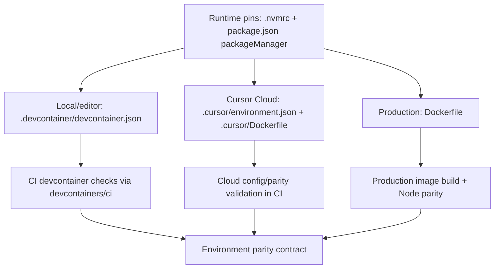
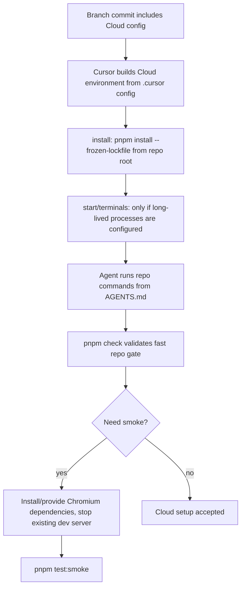

# feat: Add Cursor Cloud Agent environment configuration

## Summary

Add version-controlled Cursor Cloud Agent environment configuration so Cloud Agents start from the same pinned runtime assumptions as local devcontainers and CI. The plan keeps `.devcontainer/` as the local and `devcontainers/ci` contract, adds `.cursor/environment.json` as the Cloud Agent contract, and guards both against runtime drift.

---

## Problem Frame

The original scaffold required a Cursor-native, deterministic setup where a fresh agent can read the repo and work without guessing. The repo already has a strong local/CI devcontainer model, but Cursor Cloud Agents do not use `.devcontainer/devcontainer.json` directly. Without a committed Cloud Agent environment contract, Cloud setup remains partly implicit and can drift from the repo's Node, pnpm, install, and verification rules.

---

## Requirements

### Cloud Agent Environment

- R1. The repo commits a Cursor Cloud Agent environment configuration that Cloud Agents resolve before personal or team saved environments.
- R2. The Cloud environment uses the same Node major and pnpm version policy as `.nvmrc`, `package.json`, `.devcontainer/devcontainer.json`, and `Dockerfile`.
- R3. Cloud startup dependency installation is idempotent and uses `pnpm install --frozen-lockfile` from the repo root.
- R4. Cloud setup does not require Postgres, `DATABASE_URL`, fly.io tokens, GitHub tokens, or local Cursor credentials to boot the app or pass the fast gate.

### Parity And Enforcement

- R5. CI verifies the committed Cloud Agent environment files for schema/shape and runtime parity.
- R6. Runtime parity checks include the Cloud Agent Dockerfile/config alongside the existing `.nvmrc`, production Dockerfile, and devcontainer checks.
- R7. Cloud Agent verification defaults to the repo's fast full gate, while Playwright smoke remains conditional on browser/system dependency setup.
- R8. Documentation distinguishes local devcontainer, CI devcontainer, production image, and Cursor Cloud Agent environments without implying one contract is consumed by all four.

### Safety And Secrets

- R9. No secrets are committed in Cloud environment configuration; Cursor Secrets, GitHub Environment secrets, fly.io secrets, and `.env.local` remain separate surfaces.
- R10. Any documented Cloud rebuild or setup recovery path tells agents when to rebuild the environment versus rerunning the idempotent install step.
- R11. Changes to Cloud Agent setup files are treated as security-sensitive because they run setup code in a remote worker before normal task execution.

---

## Key Technical Decisions

- KTD1. **Add `.cursor/environment.json` as the Cloud Agent contract.** Cursor Cloud Agents resolve repo-level `.cursor/environment.json` before saved personal or team environments, and official docs recommend committing it for team consistency.
- KTD2. **Use a lightweight `.cursor/Dockerfile` for runtime determinism.** A Cloud Dockerfile gives the repo an explicit Node/pnpm base instead of inheriting whatever the default Cloud image provides, while keeping local and CI devcontainer behavior in `.devcontainer/`.
- KTD3. **Mirror invariants, not implementation mechanisms.** The local devcontainer can keep Dev Containers features and named volumes; the Cloud environment should mirror Node, pnpm, frozen install, ports, and verification expectations through Cloud-native config.
- KTD4. **Do not auto-run smoke in Cloud setup.** `pnpm check` is the default Cloud validation target. Browser/system dependencies for `pnpm test:smoke` are documented or added later only if Cloud smoke becomes a required workflow.
- KTD5. **Guard drift with scripts and CI.** The implementation should extend existing parity checks rather than relying on prose that says Cloud and devcontainer setups should match.
- KTD6. **Treat Cloud Agents as remote workers with least-privilege secrets.** Committed Cloud config may contain public setup metadata, non-secret defaults, and secret names when necessary, but not secret values, credential-bearing Docker layers, local auth state, or production tokens. Cloud Agents should not be started from untrusted branches or forks with secrets enabled.

---

## System-Wide Impact

| Invariant           | Source of truth                        | Local / CI consumer                                     | Cloud consumer                                  | Enforcement                                              |
| ------------------- | -------------------------------------- | ------------------------------------------------------- | ----------------------------------------------- | -------------------------------------------------------- |
| Node major          | `.nvmrc`                               | `.devcontainer/devcontainer.json`, `Dockerfile`         | `.cursor/Dockerfile`                            | `scripts/check-node-parity.sh` extended for Cloud        |
| pnpm version policy | `package.json` `packageManager`        | `pnpm install --frozen-lockfile` in devcontainer and CI | Cloud `install` plus `.cursor/Dockerfile` setup | Cloud validation script exposed through `package.json`   |
| Dependency install  | `package.json` scripts and lockfile    | `updateContentCommand`, CI named checks                 | `.cursor/environment.json` `install`            | CI validation plus fresh Cloud acceptance proof          |
| Postgres            | `docker-compose.yml`, `.env.example`   | Local optional service                                  | Not required by default                         | `/healthz` remains healthy with `DATABASE_URL` unset     |
| Secrets             | Secret stores, never repo files        | GitHub/fly/local stores as documented                   | Cursor Secrets for Cloud-only needs             | Secret-pattern checks plus manual least-privilege review |
| Smoke tests         | `docs/testing.md`, `e2e/smoke.spec.ts` | CI/deploy and explicit local runs                       | Conditional Cloud workflow                      | Docs and optional Cloud image support                    |

---

## Threat Model

- A branch changes `.cursor/environment.json` or `.cursor/Dockerfile` to exfiltrate Cursor Secrets during setup. Mitigation: treat those files as privileged, add review ownership if the repo has CODEOWNERS, and document that secret-enabled Cloud runs should only start from trusted branches.
- A broad Cloud Docker build context or Dockerfile instruction bakes `.env*`, auth files, package-manager credentials, or generated secrets into image layers. Mitigation: scoped static checks, no-secret Docker builds, and explicit forbidden patterns for Cloud setup files.
- A Cloud snapshot, setup log, shell history, or generated artifact retains a token after a failed verification run. Mitigation: default no-secret acceptance runs, rotation guidance for accidental exposure, and a reviewer-recorded checklist for any secret-enabled Cloud run.

---

## High-Level Technical Design

### Environment Contracts

### Cloud Agent Lifecycle

---

## Implementation Units

### U1. Add the Cursor Cloud Agent environment contract

- **Goal:** Commit the repo-level Cloud Agent environment configuration that Cursor Cloud can resolve automatically.
- **Requirements:** R1, R3, R4, R9, R11.
- **Dependencies:** none.
- **Files:** `.cursor/environment.json`, `.cursor/Dockerfile`, `.dockerignore` only if Cloud build context rules require a scoped adjustment.
- **Approach:** Add `.cursor/environment.json` with Cursor's schema URL, repo name, Dockerfile build settings, install command, and any non-secret port/terminal metadata that materially helps Cloud Agents. Add `.cursor/Dockerfile` with the same Node major and pnpm activation policy as the repo, including `git` and `sudo` if the selected base image does not provide them. Do not copy the repo into the image; Cursor checks out the target commit. The Dockerfile must build without credentials and must not use secret-bearing `ARG`, `ENV`, package registry tokens, auth files, generated credential files, or `.env*` content.
- **Patterns to follow:** `.devcontainer/devcontainer.json` for Node major and install intent; `Dockerfile` for Node `ARG` naming and production parity language; official Cursor Cloud environment setup docs for path and lifecycle rules.
- **Test scenarios:**
  - A fresh Cloud Agent run on a branch containing the config resolves the repo-level environment rather than a saved personal/team environment.
  - Re-running the Cloud install command after dependencies are already present completes without tracked file changes.
  - The app boots and `/healthz` remains healthy with `DATABASE_URL` unset.
  - No committed Cloud config contains `CURSOR_API_KEY`, `GH_TOKEN`, `DATABASE_URL`, fly.io tokens, registry tokens, or copied `.env.local` content.
  - The Cloud Dockerfile build context can see only the files it needs, and any `.dockerignore` adjustment does not change the production image build context unexpectedly.
  - Cloud setup files contain no broad repo-copy instruction that would capture local auth or generated artifacts.
- **Verification:** The Cloud Agent setup log shows the committed environment was used; `pnpm install --frozen-lockfile` completes from repo root; `pnpm check` can run after setup.

### U2. Extend parity and schema validation

- **Goal:** Make Cloud Agent configuration an enforced contract instead of a prose convention.
- **Requirements:** R2, R5, R6, R9, R11.
- **Dependencies:** U1.
- **Files:** `scripts/check-node-parity.sh`, a new Cloud environment validation script if needed, `package.json`, `.github/workflows/build-artifacts.yml`, `CODEOWNERS` if the repo adopts one for privileged setup files.
- **Approach:** Extend the Node parity guard to parse the Cloud Dockerfile and any Node declaration in Cloud config. Add a lightweight validation script for `.cursor/environment.json` and `.cursor/Dockerfile` covering schema/shape, pnpm policy, frozen install, scoped forbidden secret patterns, forbidden `ARG`/`ENV` names, broad copy patterns, and required Cloud image tools. Expose the validation through a `package.json` script. In `build-artifacts.yml`, add the Node/pnpm setup needed to run that package script, then add a named job near the existing Node parity check. Add a separate no-secret Cloud Dockerfile build check if static validation cannot prove the image reaches the setup phase.
- **Patterns to follow:** `scripts/check-node-parity.sh` for direct, reviewable checks; `.github/workflows/build-artifacts.yml` for named parity jobs; `package.json` scripts as the command source of truth.
- **Test scenarios:**
  - Changing the Cloud Dockerfile to a different Node major makes the parity check fail with a clear message.
  - Changing `.nvmrc` without updating Cloud config fails the parity check.
  - Changing the Cloud pnpm setup away from `package.json`'s `packageManager` policy fails validation.
  - Changing the Cloud install command away from frozen-lockfile behavior fails validation.
  - Invalid `.cursor/environment.json` shape fails the Cloud config validation before merge.
  - A committed Cloud config or Cloud Dockerfile with sensitive-looking keys or values fails a check scoped to Cloud Agent config files, while documented secret names without values are allowed.
  - The Cloud Dockerfile builds without secrets and exposes `git`, `sudo`, `node`, and the repo's pnpm policy before Cursor runs the install step.
  - Valid Cloud config plus matching pins passes on a clean checkout.
- **Verification:** CI exposes a named Cloud/parity failure when config drifts and stays green when all environment pins match.

### U3. Update documentation and agent entry points

- **Goal:** Make the four environment surfaces understandable to humans and agents without contradicting the repo principles.
- **Requirements:** R4, R8, R9, R10.
- **Dependencies:** U1, U2.
- **Files:** Candidate docs: `AGENTS.md`, `README.md`, `docs/devcontainer.md`, `docs/local-dev.md`, `.devcontainer/README.md`, `.env.example`.
- **Approach:** Revise docs so `.devcontainer/` is described as local/editor plus CI, `.cursor/environment.json` as Cursor Cloud, `Dockerfile` as production, and shared parity as pinned Node/pnpm plus validation. Correct stale claims in `README.md`, `docs/local-dev.md`, and `docs/devcontainer.md` that imply Postgres is automatically started by the current image-only devcontainer or that the devcontainer is consumed by Cloud Agents. Clarify that Cloud setup has no default database, no committed secrets, and may require an environment rebuild when Cloud config, Dockerfile, Node, pnpm, or system packages change.
- **Execution note:** Edit only docs that currently make environment, Postgres, Cloud Agent, or secret-placement claims; avoid churn in files that do not mention those surfaces.
- **Patterns to follow:** `AGENTS.md` for concise agent-facing caveats; `docs/devcontainer.md` for the parity claim; `PRINCIPLES.md` for mechanism-backed prose.
- **Test scenarios:**
  - A reader can identify which environment file controls local dev, CI checks, Cloud Agents, and production.
  - A Cloud Agent can follow `AGENTS.md` from a fresh session and know to run direct `pnpm` commands rather than devcontainer/Docker Compose commands.
  - Docs route secrets to Cursor Secrets, GitHub Environment secrets, fly.io secrets, or local `.env.local` without suggesting committed secrets.
  - Docs explain that changes to Cloud config or its Dockerfile require a Cloud environment rebuild or new setup run, while dependency-only changes rely on the install step.
- **Verification:** Documentation contains no contradictory claims about Postgres auto-start, Cloud Agents consuming `.devcontainer/devcontainer.json`, or Cursor secrets being interchangeable with GitHub/fly/local secrets.

### U4. Define Cloud verification and smoke-test boundaries

- **Goal:** Ensure Cursor Cloud Agents can prove the normal repo gate without making browser smoke a hidden startup dependency.
- **Requirements:** R3, R4, R7, R10.
- **Dependencies:** U1, U2, U3.
- **Files:** `AGENTS.md`, `docs/devcontainer.md`, `docs/testing.md`, optional `.cursor/environment.json` terminal or port settings.
- **Approach:** Document `pnpm check` as the Cloud acceptance gate after setup. Preserve the existing smoke-test caveat: `pnpm test:smoke` starts its own dev server and needs Chromium, so it should not be run while `pnpm dev` is already active. If implementation needs Cloud smoke as a first-class workflow, add browser/system dependencies to `.cursor/Dockerfile` and document the reason; otherwise leave smoke as an explicit opt-in command with setup notes.
- **Patterns to follow:** Existing `AGENTS.md` Cursor Cloud caveats; `docs/testing.md` smoke-test documentation; `e2e/smoke.spec.ts` for current smoke scope.
- **Test scenarios:**
  - A fresh Cloud Agent can run `pnpm check` after setup without Postgres or browser system dependencies.
  - A Cloud Agent attempting smoke receives clear setup guidance for Chromium and the "no running dev server" constraint.
  - Starting `pnpm dev` in Cloud uses the repo's `60517` port convention and does not conflict with the smoke test's own server.
- **Verification:** The Cloud setup instructions lead to a green `pnpm check`; smoke instructions are explicit enough that an agent does not infer they are part of every startup.

### U5. Capture Cloud acceptance evidence

- **Goal:** Prove the committed Cloud contract works in the environment CI cannot fully emulate.
- **Requirements:** R1, R3, R4, R10, R11.
- **Dependencies:** U1, U2, U3, U4.
- **Files:** `docs/devcontainer.md`, `AGENTS.md`, optional `docs/testing.md`.
- **Approach:** After the Cloud config is committed on a branch, start a clean Cloud Agent setup and inspect the setup evidence: repo-level config selected, runtime pins match, install runs from repo root, no local-only services are required, and `pnpm check` passes. Record the evidence in the docs as an acceptance checklist rather than hard-coding transient setup logs. If secrets were accidentally exposed in a Cloud workspace or snapshot during verification, treat deletion as insufficient and rotate the affected secret.
- **Patterns to follow:** `PRINCIPLES.md` for clean-context verification; `docs/devcontainer.md` for honest parity caveats.
- **Test scenarios:**
  - A clean Cloud Agent run reports the repo environment as the selected environment.
  - The Cloud runtime reports the planned Node major and pnpm policy.
  - `pnpm check` passes without `DATABASE_URL`, Cursor auth state, GitHub tokens, or fly tokens.
  - No secret values appear in setup logs, shell history, generated artifacts, or snapshot notes from the no-secret acceptance run.
  - Any secret-enabled Cloud run records who reviewed the secret access scope and why the secret was needed.
  - A documented recovery path tells maintainers when to start a new setup run, refresh a snapshot, or rotate a leaked secret.
- **Verification:** The acceptance checklist is completed from a fresh Cloud setup and leaves no committed transient logs, credentials, or machine-specific paths.

---

## Scope Boundaries

### Deferred for later

- Making Postgres mandatory in Cursor Cloud Agents or adding Docker-in-Docker/Compose support for Cloud database workflows.
- Making `pnpm test:smoke` a required Cloud Agent startup or acceptance gate.
- Replacing the local/CI `.devcontainer` contract with Cursor Cloud configuration.
- Migrating production to use the devcontainer or Cloud Agent image.

### Outside this repository's identity

- Committing personal Cursor settings, auth state, `.env.local`, or secrets.
- Treating Cursor snapshots as the durable source of truth when a repo-level config file can be reviewed and versioned.

---

## Risks & Dependencies

- **Cursor Cloud config semantics can change.** Use the published schema URL and official docs as the source; keep validation lightweight so updates are easy.
- **Two environment contracts can drift.** The mitigation is parity scripting and CI, not duplicated prose.
- **Snapshots can hide config changes.** Docs should tell agents and maintainers to start from a branch with committed config and run a new setup/rebuild when Cloud environment files change.
- **Browser smoke increases image complexity.** Keeping smoke conditional avoids installing heavy system dependencies into every Cloud Agent startup.
- **Secrets have multiple homes.** Cursor Secrets, GitHub Environment secrets, fly.io secrets, and local `.env.local` must stay distinct in documentation and examples.
- **Docker layers can preserve credentials.** The Cloud Dockerfile must not bake tokens, `.env*`, auth files, package-manager credentials, or generated secret artifacts into any layer.
- **CI cannot fully inspect external secret stores.** CI should reject committed secret patterns and no-secret runtime dependencies, while the Cloud acceptance checklist covers Cursor Secrets and snapshot hygiene.

---

## Sources & Research

- Origin requirements: `docs/brainstorms/2026-06-13-uapkb-scaffolding-requirements.md`, especially the devcontainer, Cursor, CI, and deterministic-enforcement requirements.
- Existing plan and shipped context: `docs/plans/2026-06-14-001-feat-uapkb-scaffolding-plan.md`.
- Local patterns: `.devcontainer/devcontainer.json`, `.devcontainer/devcontainer-lock.json`, `.github/workflows/quality-checks.yml`, `.github/workflows/build-artifacts.yml`, `scripts/check-node-parity.sh`, `AGENTS.md`, `PRINCIPLES.md`.
- Official Cursor docs: Cloud Agent environment setup, Cloud Agent settings, security/network, and environment configuration as code guidance.
- External examples: public Cursor Cloud environment config PRs in projects such as Cypress and Scalar, which align Cloud Agent images with existing CI/runtime assumptions through committed `.cursor/environment.json` and Dockerfiles.
